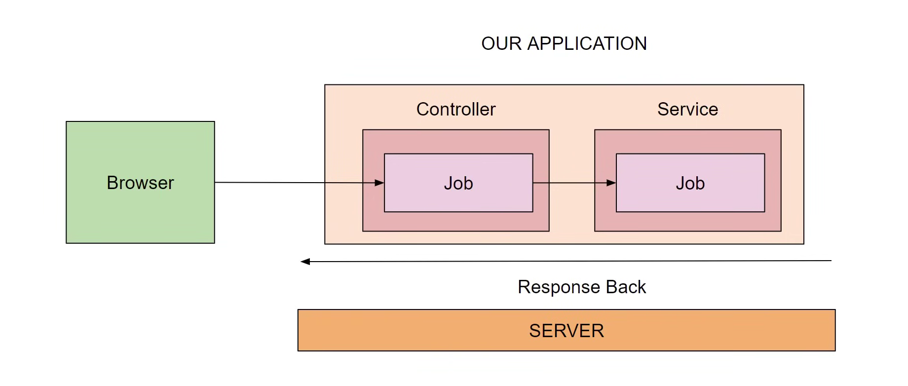

# Java SrpingBoot Microservices

## Introduction to Springboot and basics of APIs

### API (Application Programming Interface)

What does it mean?

-   Set of rules or protocols that allow one software application to interact and commuunicate with another
-   We can think it as a messenger that delivers your request to provider that you are asking a services from and then it deliver the response from the provider back to you in form of response

Why API's needed?

-   Share Data
-   Speed up development
-   Extend the reach and functionality of software

Popular APIs

-   Google Map API
-   Twitter API
-   Facebook's Graph API
-   Amazon s3 API

Type of APIs

-   Internal API
-   External APIs
-   Partner APIs

Status Codes in API

Classification of Status Codes

-   1xx(Information): Request is received and process is continuing
-   2xx(Successful): Request was successfully received understood and a
-   3xx(Redirection): further action must be taking in order to complete the request that you send
-   4xx(Client Error): Issue must be at your
-   5xx(Server Errror): server fail to fullfil the request, may be server crash

Commonly used status code

-   200 OK
-   201 Created
-   204 No Content
-   301 Moved Permanently
-   400 Bad Request
-   401 Unauthorized
-   403 Forbidden
-   404 Not found
-   500 Internal Server Error

Types of API requests

-   Get:

    1. To retrieve or get resources from server
    2. Used only to read data

-   Post:

    1. Create resources from server

-   Put:

    1. Update existing resources on server

-   Delete:
    1. Used to delete resources from server

### What is a web Framework

Why do you need web framework?

-   Websites have a lot in common
-   Security, Databased, URLs, Authentication... more
-   Should you do this everytime from scratch?

Think of building a House

-   You would need Blueprint and tools
-   That's how web development works
-   Developers had to build from scratch

What if..

-   You could have prefabricated components?
-   Could you assemble faster?
-   Could you reduce errors?
-   would that make you fast?

What is framework?

-   Web Framework is nothing but collection of tools and moudles that needed to do standard tasks across every web application

Popular Web Frameworks

1. Spring Boot (Java): Netflix
2. Django (Python): Instagram, Pinterest
3. Flask (Python):
4. Express (JavaScript): LinkedIn
5. Ruby on Rails-ROR (Ruby): Twitter

### Introduction to Spring Framework

Spring takes away the hassle of creating application which was further improved by Spring boot

Beans: Objects that are managed by spring framework are knows as Beans.

Feature of Spring Frameworks

-   Inversion of Controls (IOC): Inversion of Control is a design principle where the control of object creation and dependency management is transferred from the application code to a framework or container.

```
public interface MessageService(){
    String getMesage();
}

public class EmailService implments MessageService{
    public String getMessage(){
        return "Email message";
    }
}


//Without IOC
public class SMSClient{
    private MessageService messageService;
    public SMSClient{
        this.messageService=new EmailService(); //Dependency created within SMSClient

    }
    public void sendMessage(){
        String message=messageService.getMessage()
        //Logic to send sms using the message
    }
}

// With IOC
public class SMSClient{
    private MessageService messageService;
    public SMSClient{
        this.messageService= messageService;

    }
    public void sendMessage(){
        String message=messageService.getMessage();
        //Logic to send sms using the message
    }
}

```

-   Data Access: Spring framework have things like JPA JDBC Hybername which makes life easy when you are making database driven application and it enables you to work with databases in easier way

-   MVC Framework:
    -   Model: Represents the data and business logic.
    -   View: Represents the UI (what the user sees).
    -   Controller:Handles user input, updates the model, and returns views.
-   Transaction Management: It provides us a unified way to manage transaction
-   Security: Spring Security is the module that is available in Spring. It helps in authentication and provide security

-   Testing Support: for Unit testing. you can easily integrate junit and mokito
-   Internationalization(i18n) and Localization(l10n): it helps to create application that can be easily be adobted by other language

### What is Spring Boot?

Open-source, Java-based framework used to create stand-alone production-grade Spring-based Application

### Spring vs SpringBoot

|                                                 Spring                                                  |                                                                            Spring Boot                                                                            |
| :-----------------------------------------------------------------------------------------------------: | :---------------------------------------------------------------------------------------------------------------------------------------------------------------: |
| 1. Lots of steps involved in setting up, configuration writing boilderplate code, deploymnet of the app | Offeres a set of pre-configured component or defaults, and elimating the need for a lots of boilerplate code that was involved in setting up a Spring applicaiton |

```
                Spring Framework
                    +
SpringBoot =    Prebuilt Configuration
                    +
                Embedded Servers
```

### Components of Spring Boot

-   Spring boot Starter: These are set of convinient dependency that can be included in your application to accelerate your development
-   Auto Configuration: It configure your spring application automatically based on the dependency that you have added
-   Spring Boot Actuator: It is for monitoring the application, gathering metrics, tracing your https request and so on
-   Embedded Server: It has embedded tomcat server
-   Spring Boot DevTools: Automatic application restart or deployment.

### Advantage of Spring Boot

-   Stand alone and Quick Start
-   Starter Code
-   Less Configuration
-   Reduce cost and application development time

### Spring Boot Architecture

1. Presentation Layer: Presentation layer present the data and the application feature to the user. This is the layer where in all the controller classes exist

2. Service Layer: Service layer is wehere bussiness logic resides in the application. Tasks such as evaluation, decision making, processing of data is done at this layer

3. Data access Layer: Data acccess layer is layer where all the repository classes resides


### Basic of GET and POST APIs

```
package com.example.FirstAPI;

import org.springframework.web.bind.annotation.GetMapping;
import org.springframework.web.bind.annotation.PostMapping;
import org.springframework.web.bind.annotation.RequestBody;
import org.springframework.web.bind.annotation.RestController;

@RestController
public class HelloController {

    @GetMapping("/hello")
    public  String hello(){
        return "hello world";
    }
    @PostMapping("/hello")
    public String helloString(@RequestBody String name){
        return "hello "+name+"! ";
    }
}

```

### Project - JOB Application


-   Step 1:

    

### What is JPA? (Java Persistence API)

-   It allows you to convert object into relation table


### Advantage of using JPA

-   Easy and Simple
-   Makes queries easier
-   Allows to save and update objects
-   Easy integration with Spring Boot

### H2 database

It is java based SQL database and following are its main feature

-   Very fast, light weighted and Open Source
-   Embedded and server modes in-memory database
-   Broswer based console application

###
